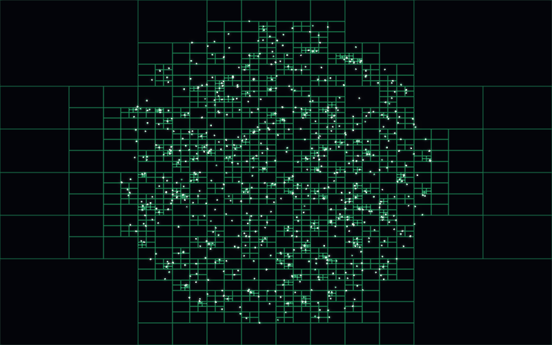
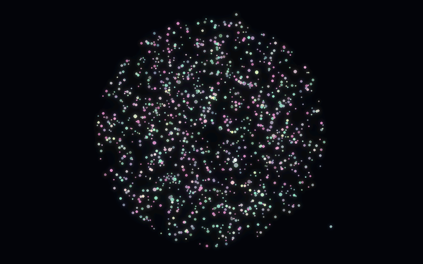
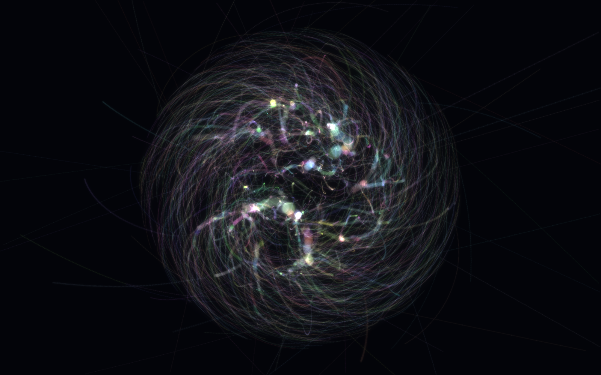
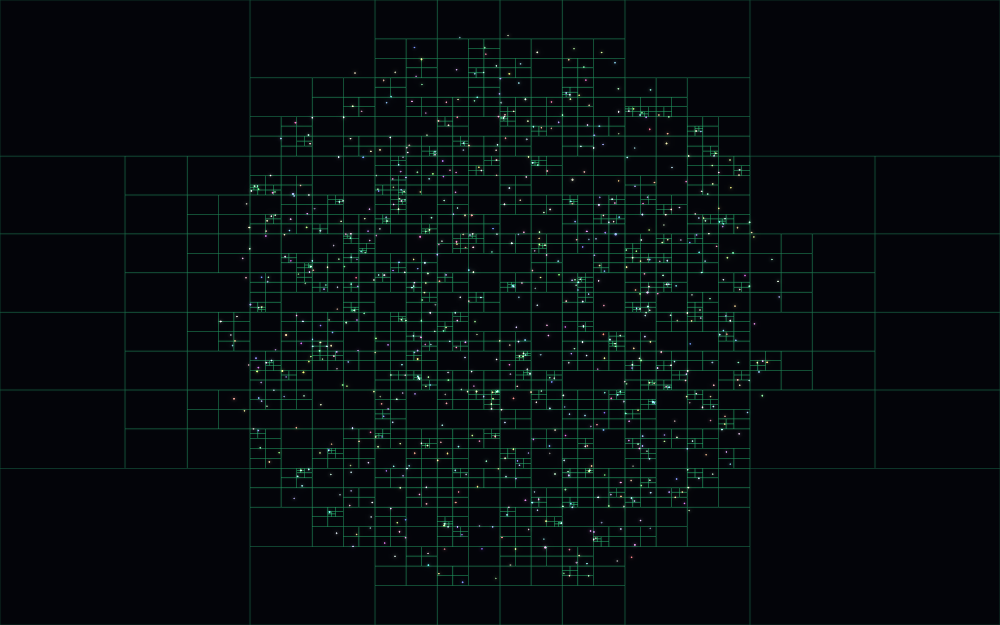
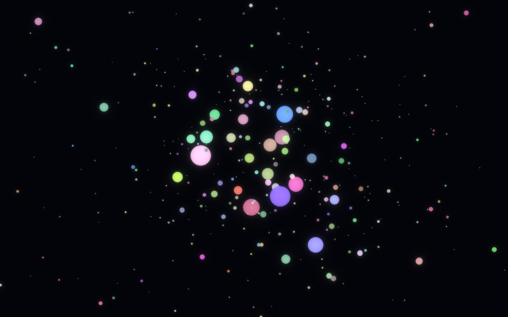
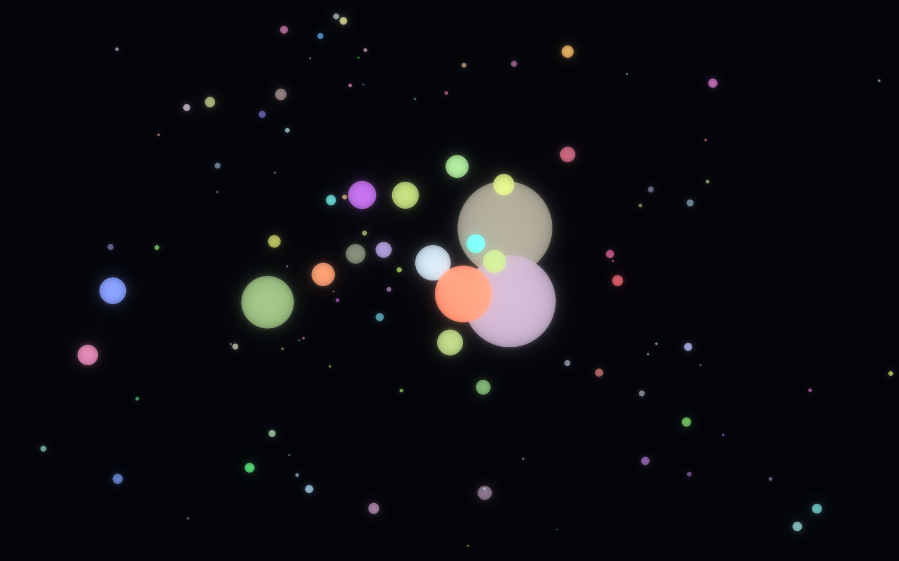
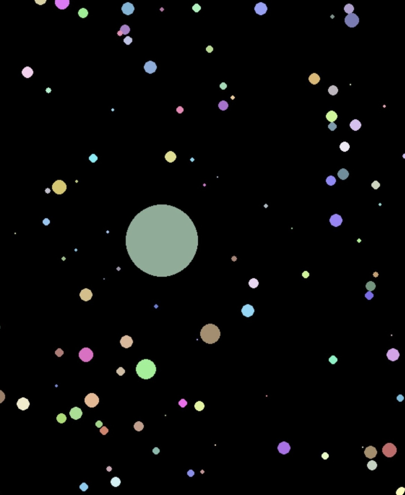
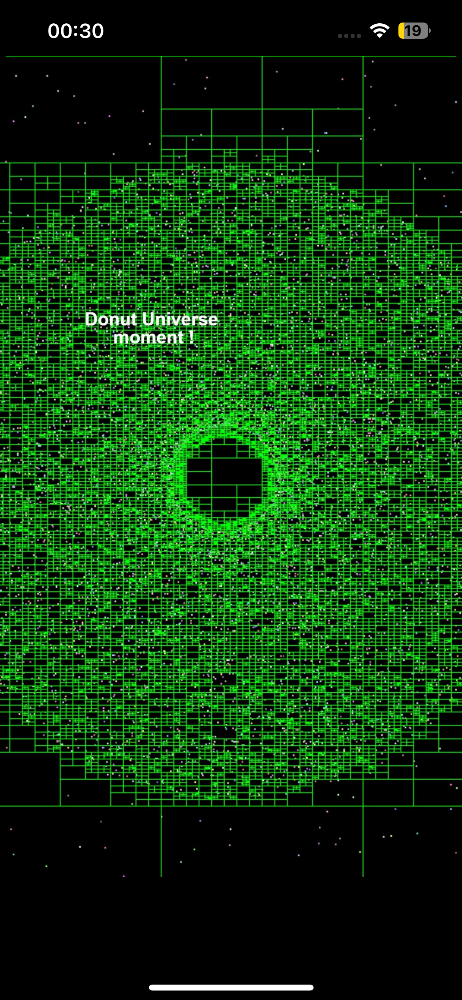

# GravSim
A 2D **N-body gravity simulator** written in Python using **Pygame**. The simulator models gravitational interactions between celestial bodies while accelerating force computation using the **Barnes-Hut algorithm** and a dynamically constructed **quadtree**.

Using the Barnes Hut approximation, this optimizes the algorithm from O(n^2) to O(n log n).

## Gallery

The quadtree rebuilding itself every frame as a galaxy collapses -cells subdivide
down into the dense core and stay coarse across empty space:



A rotating galaxy spawned with the `S` tool, coalescing into planets:



|  |  |
| --- | --- |
|  |  |
| **Long exposure** - 140 simulation steps of orbital paths accumulated on one canvas. | **Subdivision detail** -recursion bottoms out at one body per leaf cell. |
|  |  |
| **Coalescence** - the disk breaking up into many small worlds. | **Planets** -momentum-conserving merges build a few large bodies. |


## Context

The Barnes-Hut algorithm decides whether a group of bodies can be approximated as a single mass using the criterion `s / d < θ`, where:

- `s` is the width of the quadtree node.
- `d` is the distance from the current body to the node's center of mass.
- `θ` is a user-defined accuracy threshold.

If `s / d < θ`, the node is sufficiently far away relative to its size, so its entire mass is approximated by its center of mass. Otherwise, the node is recursively subdivided and its children are evaluated individually.

**Smaller values of `θ` produce higher accuracy at the cost of more computations, while larger values improve performance by allowing more approximations.**

## Features

* Barnes-Hut approximation for efficient gravitational force computation
* Dynamic quadtree spatial partitioning
* Interactive body creation and orbital spawning
* Collision detection with momentum-conserving body merging
* Real-time quadtree rendering

## Implementation

Each simulation step:

1. Construct a quadtree over all bodies.
2. Compute the center of mass for each node.
3. Traverse the tree using the Barnes-Hut criterion (`s / d < θ`) to approximate distant regions.

Gravity is computed using Newton's law (`F = Gm₁m₂ / r²`), while collisions merge bodies by conserving linear momentum (`m₁v₁ + m₂v₂ = (m₁ + m₂)v_f`).

## Technologies

* Python
* Pygame
* NumPy
* Tkinter

## Run

```bash
pip install pygame numpy screeninfo
python3 main.py
```

## Controls

| Input           | Action                                             |
| --------------- | -------------------------------------------------- |
| **Left Click**  | Create a body                                      |
| **Right Click** | Create a body with an initial orbital velocity     |
| **Mouse Wheel** | Adjust the radius of the body being placed         |
| **R**           | Toggle resize mode                                 |
| **G**           | Generate random bodies                             |
| **S**           | Spawn a rotating galaxy/body cluster at the cursor |
| **X**           | Configure galaxy generation parameters             |
| **T**           | Set the Barnes-Hut threshold `θ`                   |
| **F**           | Set the maximum random body radius                 |
| **D**           | Toggle quadtree visualization                      |
| **E**           | Clear all bodies                                   |

## Renders

The images above are generated by running this simulator headlessly -the same
`Body`, `QuadTrees`, `spin()` and collision code, driven one `main.py` loop
iteration per frame -and re-drawing each frame with Pillow for anti-aliasing and
bloom. `media/tools/shim/` supplies stand-ins for `pygame`, `numpy`, `screeninfo`
and `tkinter` so `main.py` imports unmodified on a machine with none of them
installed; the pygame shim records draw calls instead of rasterising them.

```bash
cd media/tools
python3 produce.py                 # regenerate everything (Pillow only)
python3 produce.py quadtree-gif    # or a single target
```

Targets: `quadtree-gif`, `quadtree-detail`, `galaxy-trails`, `planets`,
`planets-closeup`, `galaxy-gif`. Every scene is seeded, so reruns are
byte-identical. Only initial conditions and render settings are tuned -notably
`BARNES_HUT_THETA = 0.5` so the tree is actually traversed, and a smaller `G` so
bodies move a few pixels per step rather than tens (the integrator uses `dt = 1`).


## Photo dump

Original screenshots from development:




